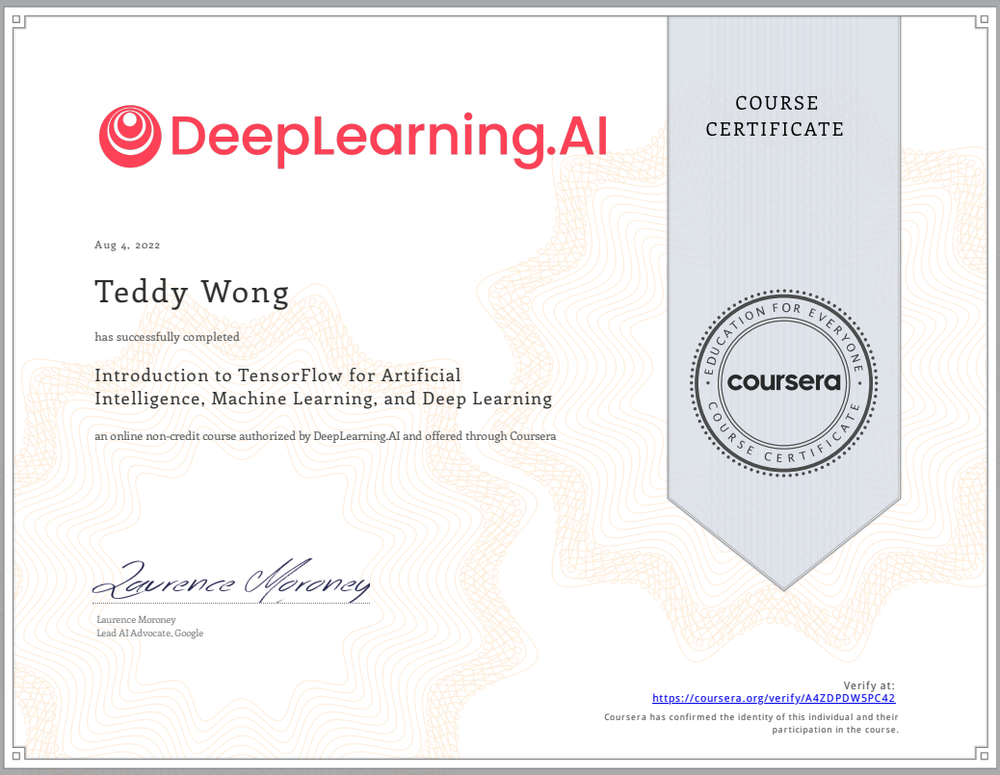

In 2015, I took Andrew Ng's ML course on Coursera in 2015, but everything has changed since then. The 2015 course had us build a neural network from scratch using matrix multiplication using Octave (open-source Matlab). Now in 2022 it's taught using python, tensorflow, and Keras API rather than using matrix multiplication. This course is better if you just want to apply machine learning or learn what's involved. This course allows you to do more in less time, but you come away with a fuzzier idea of what's happening in the neural network. However, it does a good job of teaching what's happening generally involved in convolutions and max pooling steps of the neural network.

It's great how easy this has gotten in the last seven years but seven years with the new tools. I started this new course/specialization earlier this week and today I finished the Introduction to TensorFlow for Artificial Intelligence, Machine Learning, and Deep Learning course. The other three courses in the specialization look interesting as well.

* Name:Introduction to TensorFlow for Artificial Intelligence, Machine Learning, and  Deep Learning
* Issuing Organization: Coursera
* Issue Date: August 2022
* Expiration Date: This certification does not expire
* Credential ID: A4ZDPDW5PC42
* Credential URL:https://www.coursera.org/account/accomplishments/certificate/A4ZDPDW5PC42

{width=80% height=80%}

Useful worksheet:

https://github.com/https-deeplearning-ai/tensorflow-1-public/blob/main/C1/W4/ungraded_labs/C1_W4_Lab_1_image_generator_no_validation.ipynb

use https://pixabay.com/ for finding additional images to test model.