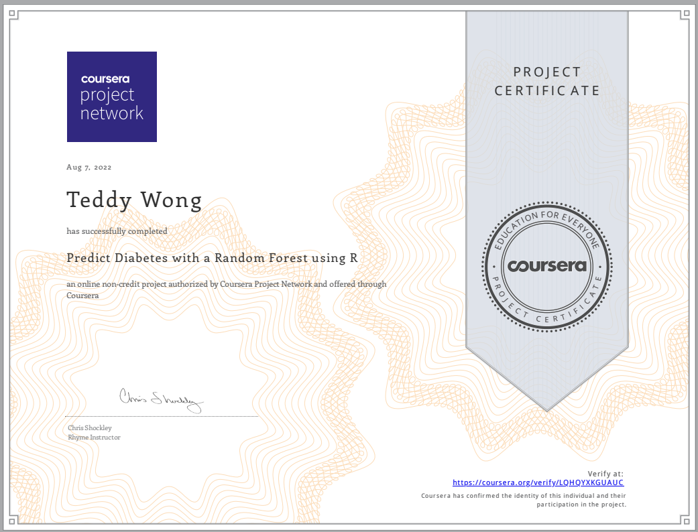

Most people have better things to do on a Saturday night after the kids are asleep. Well, this is my idea of a fun evening... Signing up for the guided project in predicting diabetes by using random forests. Here we go...

# Course Objectives
In this course, we are going to focus on four learning objectives:

Complete a random Training and Test set from one Data source using both an R function and using Base R.

Practice exploratory data analysis using ggplot2

Apply a Linear Model, GBM, Random Forest model to a data set.

Examine the results using RMSE and a Confusion Matrix.

By the end of this course, you will be able to apply and examine your own Machine Learning algorithms.

# Course Structure

This course is divided into 3 parts:

1. Course Overview: This introductory reading material.

2. Machine Learning:  Predict Diabetes using Pima Indians Data Set: This is the hands on project that we will work on in Rhyme.

3. Graded Quiz: This is the final assignment that you need to pass in order to finish the course successfully.

# Project Structure
The hands on project on Predict Diabetes using Pima Indians Data Set:  is divided into following tasks:

* Task 1: In this task the Learner will be introduced to the Course Objectives, which is to how to execute a Random Forest Model using R and the Pima Indians Data set.  There will be a short discussion about the Interface and an Instructor Bio.

* Task 2:  The Learners will get practice doing Exploratory Analysis using ggplot2.  This is important in order for the practitioner to see the balance of the data, especially as it relates to the Response Variable.

* Task 3: The Learner will get experience creating Testing and Training Data Sets.  There are multiple ways to do this in R.  The Instructor will show the Learner how to do it using the Base R way and also using a function from the caret package.  

* Task 4: The Learner will get experience with the syntax of the Caret, an R package.  Then the Learner will create a Random Forest Model in one function call.

* Task 5: The Learner will get practice looking and comparing multiple models using RMSE among other metrics.

# Meet the Instructor

My name is Chris Shockley.  I use R every day for work.  I like building quick machine learning models to answer questions.  For fun I like Astronomy and working out.  And of course teaching.  I look forward to helping you by providing some fun projects that will assist you in your R journey.

```{r}
library(neuralnet)
library(caret)
library(tidyverse)
library(mlbench)
library(e1071)
```
```{r}
data("PimaIndiansDiabetes")
df <- PimaIndiansDiabetes
str(df)
?PimaIndiansDiabetes
ggplot(df,aes(diabetes, fill = factor(diabetes))) + geom_bar()
```
create binary variable
```{r}
df$binary <- ifelse(df$diabetes == "neg", 0, 1)
str(df)
```

```{r}
rows <- createDataPartition(df$binary,times=1, p=.7,list=FALSE)
# remove diabetes variable since it's collinear with binary variable.
df<-df[,-9]

names(df)
```

```{r}
train <- df[rows,]
test <- df[-rows,]

dim(train)
dim(test)

```

random forest so response variable is a factor. "ranger" is random forest in caret.

```{r}
model <- train(as.factor(binary) ~ .,
               data = train,
               method = "ranger",
               trControl = trainControl(method = "repeatedcv", number = 2, repeats = 2))
```

```{r}
model
```

```{r}
pred_train <- predict(model, train)
pred_test <- predict(model, test)

pred_train

#create confusion matrix

confusionMatrix(pred_train, as.factor(train$binary))
confusionMatrix(pred_test, as.factor(test$binary))

```

So accuracy isn't terrible, being able to predict around 74% accuracy in the test set.

That's the end of the course. It's quite short and didn't have much technical explanation of what's happening, just a guided homework assignment basically.

Let's see if we can improve upon the results by trying a different algorithm or by normalizing the variables.

Let's try a neural net.

```{r include=FALSE}
model2 <- train(as.factor(binary) ~ pregnant + glucose + pressure,
               data = train,
               method = "nnet",
               )
```
```{r}
model2
```
```{r}
pred_train <- predict(model2, train)
pred_test <- predict(model2, test)

pred_train

#create confusion matrix

confusionMatrix(pred_train, as.factor(train$binary))
confusionMatrix(pred_test, as.factor(test$binary))
```

Normalizing variables using the scale function.

```{r include=FALSE}
df2 <- df %>% mutate_at(c("pregnant", "glucose","pressure","triceps","insulin","mass","pedigree","age"), ~(scale(.) %>% as.vector))

train <- df2[rows,]
test <- df2[-rows,]

model3 <- train(as.factor(binary) ~ pregnant + glucose + pressure,
               data = train,
               method = "nnet",
               )
```
```{r}
model3
```
```{r}
pred_train <- predict(model3, train)
pred_test <- predict(model3, test)

pred_train

#create confusion matrix

confusionMatrix(pred_train, as.factor(train$binary))
confusionMatrix(pred_test, as.factor(test$binary))
```

{width=80%}