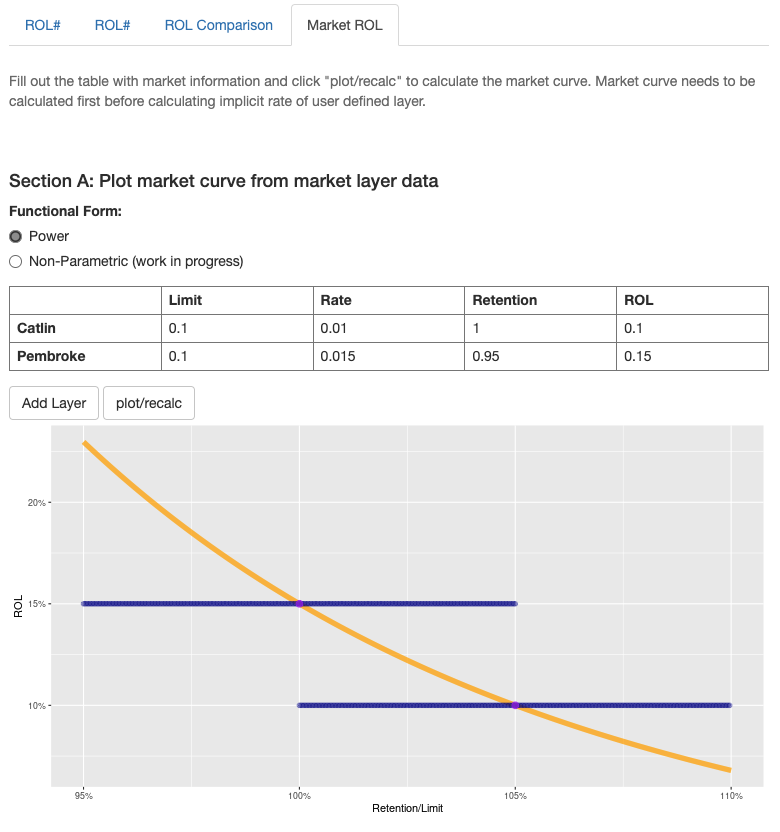
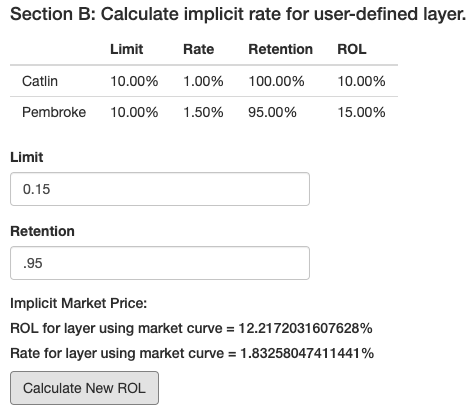
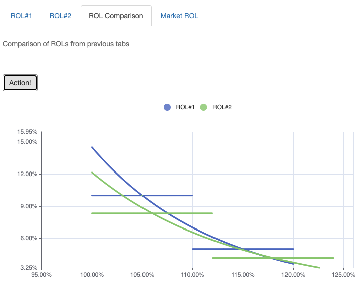

When I was working with stop loss reinsurance contracts the usual way to perform the pricing exercise would be to gather all the loss data, fit a loss distribution to that data, make adjustments based on seasonal outlook or other variables, and apply the limits and retentions asked by the clients/brokers. 

Although this is standard practice and almost second nature, another way to look at the pricing problem is from the point of view that you, as an underwriter, do not have all the information and perhaps should take into consideration market pricing. Reinsurance is often a market that suffers from what in auction theory is called "winner's curse", that you'll get the business if you offer a lower price than the competition but that just means you may have mis-priced the risk in order to gain the business! 

To prevent going too astray from market pricing then, it's helpful to look at the market price graphically as a curve. I've called it the 'implied rol' curve previously. I have used a spreadsheet to draw this curve from pricing data, either prior years, or similar risks, to do this. But it was cumbersome to wrestle all the columns and rows used in the calculations. So, I decided to create a R Shiny app to make the process a lot easier and as a way to learn the programming needed to implement it. The app is live now at https://twong.shinyapps.io/Implied_rol/  

As can be seen in the image file below, this app allows you to input stop loss layer pricing information and will fit the power curve to the layers. 

{width=80%}

You can now input new layer limit and retention and calculate the pricing of that new layer based on the calculated power curve. In this case, a layer of 15% xs 95% given the layers used above gives a price of 1.83% and a ROL of 12.21%.

{width=80%}

This little tool then provides a good back of the envelope calculation for what a new layer might cost. This is not a precise pricing method since the real underlying curve requires a lot more information about the underlying risk.

The other tabs in the app allows for comparisons of two different pricing regimes. For example, if there are two companies with similar underlying risks, it would be easy to visually compare the pricing curves given the pricing data.

{width=80%}

I found the paper by [David Morel](https://www.casact.org/sites/default/files/2021-02/2013_morel.pdf) very useful in thinking about these curves and I might try to implement his spline curve or some other non-parametric curves in the future.

