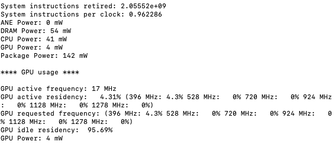

I found that rsessions-arm64 was running the cpu at 100% and using almost 7 watts (it's around 20 mW when idle), and ran my laptop battery down very quickly. A restart seem to have solved the problem.

Using command "sudo powermetrics" in terminal opens up the powermetrics program that's included in osx and provides data on power usage as shown in the following screenshot:

